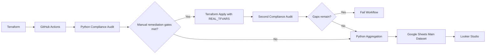

# cloudflare_IaC
Cloudflare Infrastructure Management (IaC) for API and Terraform bulk retrieval and update of multiple domain security settings

## Branch And PR Expectations

`main` is the production trunk. `dev` is the staging and experiment branch.
Pull requests should target `dev` or `main`, pass the lightweight quality
workflow, and avoid generated reports, local secrets, Terraform state, or real
infrastructure values.

PR validation is intentionally non-destructive. It runs Python quality checks,
Terraform formatting, and Terraform validation. Terraform plans may use mock
values from `terraform/ci.auto.tfvars` only in a safe mock-state/no-real-state
context.

## Governance

Project operating rules live in [AGENTS.md](AGENTS.md). Pull requests should use
the [.github/pull_request_template.md](.github/pull_request_template.md), and
ownership is defined in [.github/CODEOWNERS](.github/CODEOWNERS).

Cloudflare provider v5 migration guidance is tracked separately in
[docs/cloudflare-provider-v5-migration.md](docs/cloudflare-provider-v5-migration.md).

## Governance

Project operating rules live in [AGENTS.md](AGENTS.md). Pull requests should use
the [.github/pull_request_template.md](.github/pull_request_template.md), and
ownership is defined in [.github/CODEOWNERS](.github/CODEOWNERS).

Cloudflare provider v5 migration guidance is tracked separately in
[docs/cloudflare-provider-v5-migration.md](docs/cloudflare-provider-v5-migration.md).

## Architecture



The main CI workflow validates Terraform, runs the Cloudflare compliance audit,
archives CSV reports, and updates Google Sheets on the weekly schedule. Manual
dispatch can also run guarded remediation or sync a privacy-safe aggregate
dataset to the `Cloudflare_Compliance_Main` Google Sheet for BI dashboards.

## Workflow Behavior

| Trigger | Quality checks | Read-only Cloudflare audit | Compliance report artifact | Google Sheets sync | Remediation |
| --- | --- | --- | --- | --- | --- |
| Pull request | Yes | No | No | No | Never |
| Push to `main` | Yes | Yes | Yes | No | Never |
| Weekly schedule | Yes | Yes | Yes | Yes, automatically | Never |
| Manual dispatch | Yes | Yes | Yes | Only with `sync_to_sheets=Y` | Only with `run_remediation=Y`, `FIX_DETECTED_GAPS=Y`, and detected gaps |

## Safety & Circuit Breakers

Pushes to `main` run audit and reporting only. Remediation is manual-only: start
the workflow with `workflow_dispatch`, set `run_remediation=Y`, and keep the
repository-level GitHub Variable `FIX_DETECTED_GAPS=Y`.

When all remediation gates are satisfied, the workflow materializes the private
`REAL_TFVARS` secret just long enough to run `terraform apply` against real
Cloudflare zones. When any gate is not satisfied, it audits and uploads reports
without attempting changes.

After remediation, the workflow immediately runs a second audit. If gaps remain,
the build fails instead of retrying indefinitely. This makes failed remediation
visible to the administrator and prevents an unsafe apply loop.

`REAL_TFVARS` is only used during guarded remediation workflows. Keep
`FIX_DETECTED_GAPS` as a repository-level GitHub Actions variable unless the job
declares an environment. If `FIX_DETECTED_GAPS` is environment-scoped, the job
must be associated with that environment before `vars.FIX_DETECTED_GAPS` is
visible to the workflow. The workflow checks `vars.FIX_DETECTED_GAPS` directly;
it does not need a job-level `FIX_DETECTED_GAPS` environment variable for
remediation gating.

## Local Setup

Create a local `.env` file with your Cloudflare credentials:

```powershell
CLOUDFLARE_API_TOKEN=your-scoped-token
CLOUDFLARE_ACCOUNT_ID=your-account-id
```

Install dependencies:

```powershell
python -m venv .venv
.venv\Scripts\python -m pip install -r requirements-dev.txt
```

Real Terraform values belong in an ignored local file such as
`terraform/terraform.tfvars`, or in GitHub Secrets for automation. Keep
`terraform/ci.auto.tfvars` limited to mock CI values.

## Validation

Run the local quality gate and Terraform safety checks. Always run validation
using the virtual environment to ensure dev dependencies, such as `ruff`, are
available.

```powershell
.venv\Scripts\python scripts/run_all_checks.py
terraform -chdir=terraform fmt -check -recursive
terraform -chdir=terraform init -backend=false
terraform -chdir=terraform validate
terraform -chdir=terraform plan -refresh=false -input=false -var-file=ci.auto.tfvars
```

Only run the `ci.auto.tfvars` plan in a safe mock-state/no-real-state context.

`.secrets.baseline` is kept for local detect-secrets pre-flight checks.
Gitleaks runs in GitHub Actions as the CI/CD history-scanning enforcement gate.

## How to Use

Run a read-only Cloudflare compliance audit:

```powershell
python run_tools.py --audit
```

Audit CSVs are written to `reports/`. The latest report is saved as
`reports/security_compliance_report.csv`, and timestamped reports are saved
alongside it for history.

Generate the compliance trend summary:

```powershell
python scripts/generate_compliance_summary.py
```

Sync historical audit reports to Google Sheets locally:

```powershell
python scripts/aggregate_to_sheets.py
```

Terraform CI uses `terraform/ci.auto.tfvars` with mock domains so GitHub
Actions can validate `terraform plan` without private domain data. Keep real
domain mappings in your local `terraform/terraform.tfvars` file.

## Terraform Safety

Pull request workflows never run `terraform apply`, remediation, Cloudflare
audits, or Google Sheets sync. State-aware audit and report upload run from the
Terraform CI workflow on `main`, by weekly schedule, or by manual dispatch.
Google Sheets sync runs automatically on the weekly schedule, and from manual
dispatch only with `sync_to_sheets=Y`. Weekly schedule runs never remediate.
Manual remediation also requires `run_remediation=Y`, the repository-level
GitHub Variable `FIX_DETECTED_GAPS=Y`, and detected compliance gaps.

Never edit Terraform state files manually. Real `.tfvars` content must stay in
local ignored files or GitHub Secrets.

Cloudflare provider v5 migration is intentionally out of scope for the hygiene
baseline. It will require replacing `cloudflare_zone_settings_override` with
per-setting `cloudflare_zone_setting` resources and handling Terraform state
migration separately.

## GitHub Actions Secrets

The state-aware workflow expects these secrets only when the relevant operation
runs:

- `CLOUDFLARE_API_TOKEN`
- `CLOUDFLARE_ACCOUNT_ID`
- `REAL_TFVARS`
- `GCP_SERVICE_ACCOUNT_KEY`
- `GOOGLE_SHEET_ID`

### Generating REAL_TFVARS from Cloudflare Zones

Use the same local `.env` file for all Cloudflare operations, including
`--audit` and `--list`. It must define `CLOUDFLARE_API_TOKEN` and
`CLOUDFLARE_ACCOUNT_ID`.

Generate Terraform-compatible domain mappings from Cloudflare:

```powershell
python run_tools.py --list
```

The command prints HCL for the Terraform `domains` variable:

```hcl
domains = {
  "example.com" = {
    zone_id = "..."
  }
}
```

Paste the output into GitHub repo -> Settings -> Secrets and variables ->
Actions -> Secrets -> `REAL_TFVARS`. GitHub stores it as a single string, and
the workflow materializes it into a `.tfvars` file at runtime; this is why the
helper outputs HCL instead of JSON.

Do not commit the generated output or paste real zone IDs into
`terraform/ci.auto.tfvars`, or use `ci.auto.tfvars` for anything except mock CI
values. `REAL_TFVARS` is only materialized during guarded remediation workflows.

Do not commit `.env`, service account JSON files, raw Cloudflare exports, real
`.tfvars`, Terraform state, or generated reports.

After a GitHub Actions run, open the workflow run in the GitHub UI and download
the `security-compliance-reports` artifact from the Artifacts section. It
contains the generated `reports/` directory and compliance CSVs from that run.

Generated reports are artifacts, not source files. Local copies under `reports/`
are ignored by Git.

## Data Privacy

The BI aggregation pipeline is designed to export compliance posture without
exposing sensitive infrastructure identifiers. Before data is written to Google
Sheets, `scripts/aggregate_to_sheets.py` removes the `zone_id` column entirely.
The script also replaces each `domain_name` with a stable alias such as
`Domain 01` or `Domain 02`.

Aliases are assigned by sorting all discovered domains alphabetically across
the audit history before numbering them. That keeps the mapping consistent
across multiple audit files while preventing raw domain names and Cloudflare
zone IDs from leaving the repository workflow.

Remediation uses real secrets only inside the guarded Terraform apply step via
`REAL_TFVARS`; the BI export remains anonymized. Google Sheets receives domain
aliases and compliance posture only, never raw domain names or `zone_id` values.
