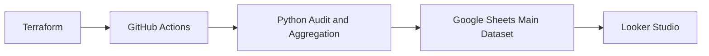

# cloudflare_IaC
Cloudflare Infrastructure Management (IaC) for API and Terraform bulk retrieval and update of multiple domain security settings

## Architecture



The main CI workflow validates Terraform, runs the Cloudflare compliance audit,
archives CSV reports, and syncs a privacy-safe aggregate dataset to the
`Cloudflare_Compliance_Main` Google Sheet for BI dashboards.

## How to Use

Create a local `.env` file with your Cloudflare credentials:

```powershell
CLOUDFLARE_API_TOKEN=your-scoped-token
CLOUDFLARE_ACCOUNT_ID=your-account-id
```

Install dependencies and run the local quality gate:

```powershell
python -m pip install -r requirements-dev.txt
python scripts/run_all_checks.py
```

Run a read-only Cloudflare compliance audit:

```powershell
python run_tools.py --audit
```

Audit CSVs are written to `reports/`. The latest report is saved as
`reports/security_compliance_report.csv`, and timestamped reports are saved
alongside it for history.

Generate the compliance trend summary:

```powershell
python scripts/generate_compliance_summary.py
```

Sync historical audit reports to Google Sheets:

```powershell
python scripts/aggregate_to_sheets.py
```

Terraform CI uses `terraform/ci.auto.tfvars` with mock domains so GitHub
Actions can validate `terraform plan` without private domain data. Keep real
domain mappings in your local `terraform/terraform.tfvars` file.

After a GitHub Actions run, open the workflow run in the GitHub UI and download
the `security-compliance-reports` artifact from the Artifacts section. It
contains the generated `reports/` directory and compliance CSVs from that run.

## Data Privacy

The BI aggregation pipeline is designed to export compliance posture without
exposing sensitive infrastructure identifiers. Before data is written to Google
Sheets, `scripts/aggregate_to_sheets.py` removes the `zone_id` column entirely.
The script also replaces each `domain_name` with a stable alias such as
`Domain 01` or `Domain 02`.

Aliases are assigned by sorting all discovered domains alphabetically across
the audit history before numbering them. That keeps the mapping consistent
across multiple audit files while preventing raw domain names and Cloudflare
zone IDs from leaving the repository workflow.
