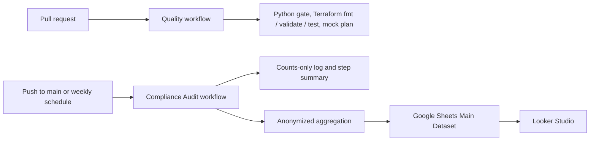

# cloudflare-iac-governance

Terraform and Python automation for governing, auditing, and reporting Cloudflare zone security posture.

## Branch And PR Expectations

`main` is the only long-lived production trunk. Work happens on short-lived
branches that target `main` through pull requests and are deleted after merge.
Pull requests must pass the lightweight quality workflow and avoid generated
reports, local secrets, Terraform state, or real infrastructure values.

PR validation is intentionally non-destructive. It runs the Python quality
gate, Terraform formatting, validation, and tests, and a mock-value Terraform plan
using `terraform/ci.auto.tfvars` in a safe mock-state/no-real-state context.

## Governance

Project operating rules live in [AGENTS.md](AGENTS.md). Pull requests should use
the [.github/pull_request_template.md](.github/pull_request_template.md), and
ownership is defined in [.github/CODEOWNERS](.github/CODEOWNERS).

Architecture decisions are recorded in [docs/adr/](docs/adr/README.md). Security
reports follow [SECURITY.md](SECURITY.md).

[policy/README.md](policy/README.md) is the single definition of the zone security
standard, enforced by Terraform and checked by the audit.

## Architecture



The `Quality` workflow validates Python and Terraform on every pull request, on
every push to `main`, weekly, and on manual dispatch. The `Compliance Audit`
workflow runs the read-only Cloudflare audit on `main`, reports counts only, and syncs a
privacy-safe aggregate dataset to the `Cloudflare_Compliance_Main` Google Sheet
for BI dashboards.

## Workflow Behavior

| Trigger | Quality checks | Read-only Cloudflare audit | Public audit output | Google Sheets sync | Terraform apply |
| --- | --- | --- | --- | --- | --- |
| Pull request | Yes | No | No | No | Never |
| Push to `main` | Yes | Yes | Counts only | No | Never |
| Weekly schedule | Yes | Yes | Counts only | Yes, automatically | Never |
| Manual dispatch | Yes (`Quality` workflow) | From `main` only (`Compliance Audit` workflow) | Counts only | Only with `sync_to_sheets=Y` | Never |

## Safety

No workflow runs `terraform apply`. CI has no durable Terraform state, so an apply
would start from empty state and act on the entire inventory rather than only on
detected gaps. Remote state, drift detection, and guarded automatic correction
are designed in
[ADR 0001](docs/adr/0001-terraform-state-and-drift-remediation.md) and arrive in
reviewed phases.

The `Quality` workflow refuses to run the mock-value plan if any Terraform state
file is present in the checkout.

## Local Setup

Create a local `.env` file with your Cloudflare credentials:

```powershell
CLOUDFLARE_API_TOKEN=your-scoped-token
CLOUDFLARE_ACCOUNT_ID=your-account-id
```

Install dependencies:

```powershell
python -m venv .venv
.venv\Scripts\python -m pip install -r requirements-dev.txt
```

Real Terraform values belong in an ignored local file such as
`terraform/terraform.tfvars`, or in GitHub Secrets for automation. Keep
`terraform/ci.auto.tfvars` limited to mock CI values.

## Validation

Run the local quality gate and Terraform safety checks. Always run validation
using the virtual environment to ensure dev dependencies, such as `ruff`, are
available.

```powershell
.venv\Scripts\python scripts/run_all_checks.py
terraform -chdir=terraform fmt -check -recursive
terraform -chdir=terraform init -backend=false
terraform -chdir=terraform validate
terraform -chdir=terraform plan -refresh=false -input=false -var-file=ci.auto.tfvars
```

Only run the `ci.auto.tfvars` plan in a safe mock-state/no-real-state context.

`.secrets.baseline` is kept for local detect-secrets pre-flight checks.
Gitleaks runs in GitHub Actions as the CI/CD history-scanning enforcement gate.

## How to Use

Run a read-only Cloudflare compliance audit:

```powershell
python run_tools.py --audit
```

Audit CSVs are written to `reports/`. The latest report is saved as
`reports/security_compliance_report.csv`, and timestamped reports are saved
alongside it for history.

Generate the compliance trend summary:

```powershell
python scripts/generate_compliance_summary.py
```

Sync historical audit reports to Google Sheets locally:

```powershell
python scripts/aggregate_to_sheets.py
```

The `Quality` workflow uses `terraform/ci.auto.tfvars` with mock domains so GitHub
Actions can validate `terraform plan` without private domain data. Keep real
domain mappings in your local `terraform/terraform.tfvars` file.

## Terraform Safety

Pull request workflows never run `terraform apply`, Cloudflare audits, or Google
Sheets sync. The read-only audit runs from the `Compliance Audit` workflow on
`main`, by weekly schedule, or by manual dispatch. Google Sheets sync runs
automatically on the weekly schedule, and from manual dispatch only with
`sync_to_sheets=Y`.

Never edit Terraform state files manually. Real `.tfvars` content must stay in
local ignored files or GitHub Secrets.

## GitHub Actions Secrets

The `Compliance Audit` workflow expects these secrets only when the relevant
operation runs:

- `CLOUDFLARE_API_TOKEN`
- `CLOUDFLARE_ACCOUNT_ID`
- `GCP_SERVICE_ACCOUNT_KEY`
- `GOOGLE_SHEET_ID`

`REAL_TFVARS` holds the explicit zone inventory. No current workflow reads it;
ADR 0001 uses it for the state adoption phases.

`CLOUDFLARE_API_TOKEN` expires if it was created with a TTL, which fails the
weekly scheduled audit with a misleading `Zone:Read` message. See
[docs/cloudflare-api-token-runbook.md](docs/cloudflare-api-token-runbook.md) for
the required scopes, how to diagnose an expired token, and how to create a
replacement.

### Generating REAL_TFVARS from Cloudflare Zones

Use the same local `.env` file for all Cloudflare operations, including
`--audit` and `--list`. It must define `CLOUDFLARE_API_TOKEN` and
`CLOUDFLARE_ACCOUNT_ID`.

Generate Terraform-compatible domain mappings from Cloudflare:

```powershell
python run_tools.py --list
```

The command prints HCL for the Terraform `domains` variable:

```hcl
domains = {
  "example.com" = {
    zone_id = "..."
  }
}
```

Paste the output into GitHub repo -> Settings -> Secrets and variables ->
Actions -> Secrets -> `REAL_TFVARS`. GitHub stores it as a single string that a
workflow can materialize into a `.tfvars` file at runtime; this is why the
helper outputs HCL instead of JSON.

Do not commit the generated output or paste real zone IDs into
`terraform/ci.auto.tfvars`, or use `ci.auto.tfvars` for anything except mock CI
values.

Do not commit `.env`, service account JSON files, raw Cloudflare exports, real
`.tfvars`, Terraform state, or generated reports.

CI audit runs publish counts only. The workflow log omits domain names, and no
report is uploaded as an artifact, because this repository is public and the
CSV contains domain names and zone IDs. For per-domain results, run
`python run_tools.py --audit` locally; reports under `reports/` are ignored by
Git.

## Data Privacy

The BI aggregation pipeline is designed to export compliance posture without
exposing sensitive infrastructure identifiers. Before data is written to Google
Sheets, `scripts/aggregate_to_sheets.py` removes the `zone_id` column entirely.
The script also replaces each `domain_name` with a stable alias such as
`Domain 01` or `Domain 02`.

Aliases are assigned by sorting all discovered domains alphabetically across
the audit history before numbering them. That keeps the mapping consistent
across multiple audit files while preventing raw domain names and Cloudflare
zone IDs from leaving the repository workflow.

Google Sheets receives domain aliases and compliance posture only, never raw
domain names or `zone_id` values.
